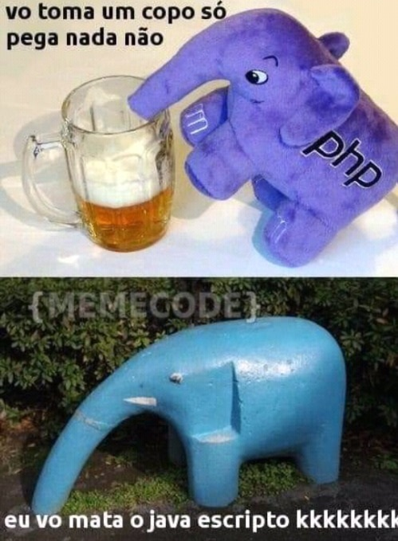
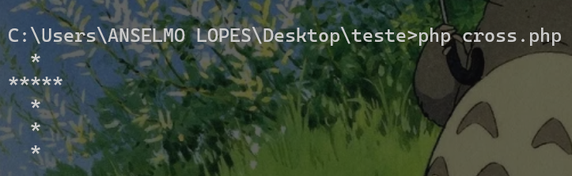
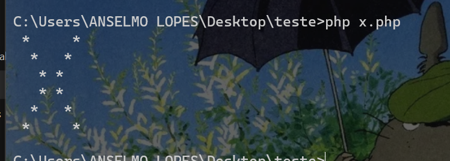

# Desafio PHP 🐘

<center>
    
</center>

---

## Tasks

---

### Cruz

Consistia em "printar" uma cruz no terminal

Resultado:



### X

Consistia em "printar" um X no terminal

Resultado:



---
## To run

Requisito: Ter o PHP instalado.

Steps:

``` git clone  https://github.com/LpxsBr/freelas.git ```

Cruz

``` php cross.php ```

X

``` php x.php ```

---

### Networks

[
    
](https://www.linkedin.com/in/anselmolopess/)
[
    
](https://www.twitch.tv/lpxsbr_)