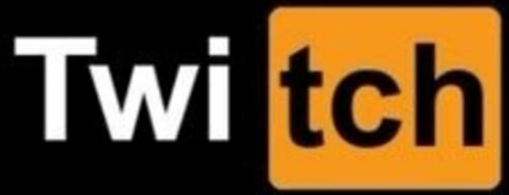

# Desafio PHP 🐘

<center>
    


---

## Tasks

#### Cruz

Consistia em "printar" uma cruz no terminal

<center>
    
</center>


#### X

Consistia em "printar" um X no terminal

<center>
    
</center>

---

Requisitos:
- Ter o PHP instalado.

---

## Rodar o projeto

Aqui, deixei duas formas.
- via terminal
- via browser

---

#### Antes de tudo, baixe o projeto :)

Baixe o projeto do github com o comando:

``` git clone  https://github.com/LpxsBr/freelas.git ```

Entre na pasta do projeto:

``` cd freelas ```


*!!!! obs: para rodar, foi criado um prefixo "shape" !!!!*

*ex: php shape fazAquiloAli*

---

#### Rodando no terminal:

para printar a cruz no terminal, digite o comando:

``` php shape cross ```

para printar x no terminal, digite o comando:

``` php shape x ```

---

#### Rodando no browser

Dentro da pasta do projeto, use o comando:

``` php shape browser ```

Dentro da pasta do projeto, depois abra no browser

[localhost:1234](http://localhost:1234)

Dentro do browser, você terá uma tela de carregamento e dois botões (X e Cruz)

---

#### resumo de comandos

printa a cruz

``` php shape cross ```

printa o x

``` php shape x ```

roda um server

``` php shape browser ```

---

### Networks

[
    
](https://www.linkedin.com/in/anselmolopess/)
[
    
](https://www.twitch.tv/lpxsbr_)